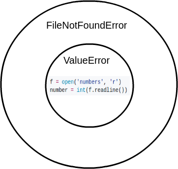
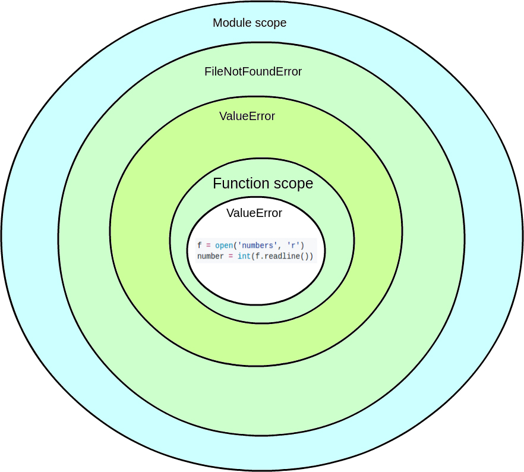

# Изключения (Exceptions)

Всеки път, когато използвате някой софтуер (било той уеб базиран или локален на устройството), от вашата гледна точка всичко може да върви гладко. Ако погледнет зад колисите, обаче, понякога може дори да ви се доплаче (хаха, тука имаше рима :Д). 

В много случаи програмата иска да изпълни нещо, но поради една или друга причина това не може да се случи, при което възниква грешка. С цел да продължи нормално работата си, софтуерът трябва да се погрижи за този случай, в който по принцип не сме искали да попаднем (да направим изключение за него).

Нека разгледаме конкретен пример. Разработвате програма, в която потребителят иска да отвори даден файл. Файлът, за съжаление, се оказва, че не съществува. Ако не се погрижим за този случай, програмата ще се счупи. Вместо да прекратява работата си, тя може да изведе съобщение към потребителя и да му каже, че файлът липсва.


## Изключения в Python
Докато пишем нашите скриптове, доста често възникват грешки в програмата. 

Някои от тях са от неправилен синтаксис:
```python
>>> if a < 3
  File "<interactive input>", line 1
    if a < 3
           ^
SyntaxError: invalid syntax
```

Други от невалидна операция:
```python
>>> 1 / 0
Traceback (most recent call last):
 File "<string>", line 301, in runcode
 File "<interactive input>", line 1, in <module>
ZeroDivisionError: division by zero
```

Или пък, както е споменато по-горе, се опитваме да отворим файл, който не съществува:
```python
open("imaginary.txt")
Traceback (most recent call last):
 File "<string>", line 301, in runcode
 File "<interactive input>", line 1, in <module>
FileNotFoundError: [Errno 2] No such file or directory: 'imaginary.txt'
```

Тези грешки възникват докато се изпълнява програмата (runtime). Всеки път, когато възникне такава грешка, Python създава т. нар. `exception` обект. Ако не сме се погрижили за за случая, се извежда съобщение за грешката, заедно с кратки детайли относно как грешката се е получила. Тази информация е предназначена за нас, като програмисти, да разберем какъв е проблемът. Ако се върнем на примера с деленето на нула:
```python
>>> 1 / 0
Traceback (most recent call last):
 File "<string>", line 301, in runcode
 File "<interactive input>", line 1, in <module>
ZeroDivisionError: division by zero
```

виждаме на кой ред е възникнала грешката - `File "<interactive input>", line 1, in <module>` и каква точно е тя - `ZeroDivisionError: division by zero`. 

В Python има набор от вградени грешки (exceptions), които съответстват на определени проблеми в програмата. [Тук](https://docs.python.org/3/library/exceptions.html) можете да видите всичките, заедно с техните описания.

## Обработка


Когато възникне грешка и тя не бъде обработена, текущият процес спира и предава грешката на извикващия процес. Ако и той не се погрижи, грешката се предава нагоре. Така, докато не се стигне до главния процес и ако грешката не бъде обработена никъде, програмата приключва работата си извънредно.

### Обработка на изключенията в Python

В Python грешките се обработват с помощта на ключовата дума `try`. След `try` трябва да има блок, в който да се изпълни критичния код (кодът, от който е възможно да се възпроизведе грешка). След което, кодът който обработва грешката, ако тя настъпи, трябва да се намира в `except` блок.

```python
try:
    f = open('random_file', 'r') # We try to open the file.
except:
    # The file is probably missing. An Error occured and this block will be executed.
    print('Sorry, but something went wrong with your file. Is it missing?')
```

Примерът по-долу добре показва как при възникване на грешка, при обработка програмата продължава. Пробвайте го и вижте резултата. Разгледайте какво и кога се случва:
```python
import sys

randomList = ['a', 0, 2]

for entry in randomList:
    try:
        print("The entry is", entry)
        r = 1/int(entry)
        break
    except:
        print("Oops!",sys.exc_info()[0],"occured.")
        print("Next entry.")
        print()
print("The reciprocal of",entry,"is",r)
```

### Обработка на специфични изключения
В примера по-горе не сме определили кои изключения(грешки) точно ще обработваме с `except` клаузата. Това не е добра практика. Обикновено знаем какви изключения искаме да обработваме и искаме да се занимаваме само с тях. Възникването на неочаквани изключения би било знак за бъг в програмата ни. За да забележим по-бързо проблема, тази грешка трябва да остане необработена и да развали нормалното изпълнение на програмата. С други думи - не сме очаквали нещо да се случи, ще е хубаво ако програмата ни крашне, че да имаме защо да кажем набор от обидни думи за нечии роднини и веднага да се заемем с проблема.

Как става обработката на изключения? Няма да ви кажа! Добре де.. 
Всяко възникнало изключение е създаден обект. Съответно този обект е описан със съответния клас. `except` ключовата дума може да приеме списък от изключенията, които трябва да се обработят в блока.

```python
def divide_by(number, divisor):
  try:
    return number / divisor
  except ZeroDivisionError:
    # handle division by zero exception
    pass

```

```python
def divide_string_nums(number, divisor):
  try:
    return int(number) / int(divisor)
  except (ZeroDivisionError, ValueError):
    # handle the two errors above
    pass
```

Ако е възможно да възникнат повече от едно изключения и трябва да се обработят поотделно.. Ами тогава плачем. Шегувам се. Има решение и за този случай:
```python
def divide_string_nums(number, divisor):
  try:
    return int(number) / int(divisor)
  except ValueError:
    # handle ValueError
    pass
  except ZeroDivisionError:
    # handle ZeroDivisionError
    pass
```

Тази комбинация също е възможна:
```python
try:
   # do something
   pass

except ValueError:
   # handle ValueError exception
   pass

except (TypeError, ZeroDivisionError):
   # handle multiple exceptions
   # TypeError and ZeroDivisionError
   pass

except:
   # handle all other exceptions
   pass
```

### Вложена try-except структура

Ето един пример за това как при възникване на грешка, тя се предава.

```python
try:

    try:
        f = open('numbers', 'r')
        number = int(f.readline())
    except ValueError:
        print('handling the value error')
        
except FileNotFoundError:
    print('handling FileNotFoundError)    
```

В случая имаме вложена try-except структура. Във вътрешния `try` блок отваряме файл, четем от него и се опитваме прочетения `string` да превърнем в число. Да кажем, че възможните грешки, които могат да възникнат са две:
1. Прочетеният `string` може да не може да се превърне в число. Ако във файла е записано 'abc' и се опитаме да го превърнем в число, ще имаме грешка. 
1. Файлът може да не съществува

В случай, че възникне първата грешка - `ValueError` - тогава тя ще бъде обработена във вътрешния `except` блок и външният дори няма да разбере, че нещо не е било наред. Ако се окаже, че файлът не съществува, тогава ще имаме `FileNotFoundError`. Python ще види, че тази грешка не може да бъде обработена във вътрешния `except` блок, затова разширява пространството, в което гледа и ще стигне до външния `except` блок. Идеята е, че тръгваме от вътре навън. По-долу има илюстрация за яснота. Прилича на поничка.





Какво ще се случи, ако кодът в `try` блока е изнесен във функция?

```python
def convert_number_from_file():
  f = open('numbers', 'r')
  number = int(f.readline())

try:

    try:
        convert_number_from_file()
    except ValueError:
        print('handling the value error')
        
except FileNotFoundError:
    print('handling FileNotFoundError)    
```

Разлика в изпълнението няма да има. Ако възникне грешка във функцията, тя ще бъде предадена до мястото, където функцията е извикана (в случая `try` блока). Ако не бъде обработена във вътрешния `try`, ще отиде към външния и тн. 

Да кажем, обаче, че правим тази малка промяна:

```python
def convert_number_from_file():
  try:
    f = open('numbers', 'r')
    number = int(f.readline())
  except ValueError: # If ValueError occurs, it will be handled here. The caller won't even know about that.
    print('handling the value error')

try:

    try:
        convert_number_from_file()
    except ValueError: # This won't be called, because the function handled this exception by itself.
        print('handling the value error')
        
except FileNotFoundError: # This still will get called, because no one else handles this kind of error inside the outer try block.
    print('handling FileNotFoundError)    
```

В този случай, при възникване на ValueError във функцията, тя ще обработи изключението сама. Блокът, който обработва `ValueError` извън функцията, никога няма да бъде изпълнен.



## Произвеждане на грешка
До тук работихме с изключения, които сами си идват. От някъде идваше грешката за делене на нула. От някъде идваше грешката, че не съществува даден файл. В много случаи ние ще бъдем хората, които ще казваме "има грешка, направи нещо по въпроса". Това се прави с ключовата дума `raise`. В един момент една от всичките операции в кода вдига ръка (raising hands) и крещи "ГРЕШКА!!!". Ето как се използва:

```python
class Person:
  def __init__(self, name):
    if '_' in name:
      raise NameError # Passing class NameError to raise
    self.name = name
    
p1 = Person('Multicet')
p2 = Person('Stamat_')
```

Ключовата дума `raise` очаква да има клас, който наследява класа `Exception` или обект, принадлежащ на този клас. Вградените в Python класове за грешки (какъвто е `NameError`) наследяват `Exception`, разбира се.

```python
class Person:
  def __init__(self, name):
    if '_' in name:
      error = NameError()
      raise error # Passing an instance of NmaeError class to raise
    self.name = name

p1 = Person('Multicet')
p2 = Person('Stamat_')
```

В посочните примери горе, имаме клас, който описва човек. Примерът е прост, затова човекът има само име. Да кажем, че единственото ограничение е, че човек не може да има долна черта в името си. Когато някой се опита да създаде обект от тип Person и подаде невалидно име, освен че казваме, че има грешка, е добре и да дадем повече информация за нея. За горния пример грешката би изглеждала така:

```python
Traceback (most recent call last):
  File "<stdin>", line 1, in <module>
  File "<stdin>", line 5, in __init__
NameError
```

За да дадем повече информация, можем просто да създадем NameError обект и да подадем на неговия __init__ метод `string`, в който описваме какво точно не е наред.

```python
class Person:
  def __init__(self, name):
    if '_' in name:
      raise NameError('Person must not have a name that contains an underscore.') 
    self.name = name
    
p1 = Person('Multicet')
p2 = Person('Stamat_')
```

```python
>>> p2 = Person('Stamat_')
Traceback (most recent call last):
  File "<stdin>", line 1, in <module>
  File "<stdin>", line 4, in __init__
NameError: Person must not have a name that contains an underscore.
```

## Изключения, дефинирани от програмиста

Разработваме система за банкиране. В нея работим с клиенти. Да кажем, че един клиент не може да е на възраст по-малка от 18 години. Ако някой се опита да създаде клиент, който е по-малък от 18 години, е добре да възпроизведем грешка. Споменато е в началото, че в Python има набор от вградени класове за грешки. Те, разбира се, са ограничен брой и в много случаи ще трябва да създадем наши. <br>
За да бъде един клас третиран като грешка, той трябва да наследява вградения клас `Exception`. Всъщност трябва да наследява `BaseException`, но конвенцията е, да се наследява `Exception`, който по своему е наследник на `BaseException`. Всички вградени класове за грешки в Python, освен `GeneratorExit`, `SystemExit` и `KeyboardInterrupt`, наследяват `Exception`, така че е добре вашите също да го правят.

```python
class AgeError(Exception):
    pass
    
class Client:
    def __init__(self, name, age):
        if '_' in name:
            raise NameError('Name must not have _ in it!')
        
        if age < 18:
            raise AgeError('Person must be >= 18 years old!')
            
        self.name = name
        self.age = age
```

Класът ни Client описва клиент с две характеристики - име и възраст. При неправилно име използваме вградения `exception` клас `NameError`. При неправилна възраст обаче използваме нашия дефиниран `exception` - `AgeError`. Забележете, че конвенцията е имената на тези класове да завършват с `Error`.

<br>
Нека погледнем класа Exception от близо. `__init__` методът на `BaseException` (който е директно наследен от Exception) всъщност има следната сигнатура - `__init__(*args)`. Какво значи тази звезда преди `args`? Значи, че на метода можем да подадем 0 или n на брой аргумента. Бърз пример:

```python
def func(*args):
    print('arguments: ' + str(args))
```
```python
func()
arguments: ()

>>> func(3)
arguments: (3,)

>>> func(3,'a')
arguments: (3, 'a')
```
Реално `*args` е `tuple` от аргументите, които сме подали. Ако не сме подали нищо, tuple-ът е празен. 

Връщаме се отново на нашия `exception` клас `AgeError`.
```python
class AgeError(Exception):
    pass
```
В него не се предефинира нито един метод. `Exception` класа, от който наследяваме, също не го прави. Това значи, че при създаването на `AgeError` обект, директно се извиква `__init__` методът на `BaseException`. Аргументите, които подадем при създаването на обекта се запазват в него. 

```python
class AgeError(Exception):
    pass
    
class Client:
    def __init__(self, name, age):
        if '_' in name:
            raise NameError('Name must not have _ in it!')
        
        if age < 18:
            raise AgeError('Person must be >= 18 years old!')
            
        self.name = name
        self.age = age
```
Да пробваме да създадем клиент с неправилна възраст:
```python
client1 = Client('Stamat', 9)
```
```
Traceback (most recent call last):
  File "<stdin>", line 1, in <module>
  File "<stdin>", line 6, in __init__
__main__.AgeError: Client's age must be >= 18 years old!
```
На последния ред виждаме съобщението, което сме подали при създаването на изключението. Съобщението след `__main__.AgeError:` стига до нас благодарение на имплементацията на метода `__str__` в `BaseException`. (Това прозвуча като реклама. Музиката достига до вас, благодарение на "Това е твоят глас. МеНтел" :D)

Ако се сещате, когато искаме да превърнем даден обект в `string` ние използваме вградената функция `str` и й подаваме този обект. Върнатият обект от `str` е резултатът от метода `__str__` на обекта, който сме подали.
```python
class Client:
    def __init__(self, name, age):
        if '_' in name:
            raise NameError('Name must not have _ in it!')
        
        if age < 18:
            raise AgeError('Person must be >= 18 years old!')
            
        self.name = name
        self.age = age
        
    def __str__(self):
        return '{} {}'.format(self.name, self.age)
```
```
>>> client = Client('Multicet', 56)
>>> str_client = str(client)
>>> print(str_client)
Multicet 56
```

В метода `__str__` на `BaseException` се крие нещо такова:
```python
def __str__(self):
    if len(self.args) == 0:
        return ''
    if len(self.args) == 1:
        return str(self.args[0])
    return str(self.args)
```

След като `AgeError` и `Exception` не предефинират нищо, всичко идва от `BaseException` и ето какво се случва:
```python
class AgeError(Exception):
    pass
```
```python
>>> err = AgeError()
>>> str(err)
''

>>> err = AgeError('wrong age')
>>> str(err)
'wrong age'

>>> err = AgeError('wong age', 9)
>>> str(err)
"('wong age', 9)"
```

Съответно ако хвърляме грешка с `raise`:
```python
>>> raise AgeError # Same as: raise AgeError()
Traceback (most recent call last):
  File "<stdin>", line 1, in <module>
__main__.AgeError

>>> raise AgeError('wrong age')
Traceback (most recent call last):
  File "<stdin>", line 1, in <module>
__main__.AgeError: wrong age

>>> raise AgeError('wrong age', 9)
Traceback (most recent call last):
  File "<stdin>", line 1, in <module>
__main__.AgeError: ('wrong age', 9)
```

### Използване на обекта на изключението
След като за всяко изключение има създаден обект, можем ли да работим с него? Може. Ето как да се сдобием с него:

```python
class AgeError(Exception):
    pass
    
class Client:
    def __init__(self, name, age):
        if '_' in name:
            raise NameError('Name must not have _ in it!')
        
        if age < 18:
            raise AgeError('Person must be >= 18 years old!')
            
        self.name = name
        self.age = age
```

```python
try:
    client1 = Client('Multicet', 9)
except AgeError as err:
    print('an exception has been thrown: ' + str(err))

Output: an exception has been thrown: Person must be >= 18 years old!
```

След като сме казали на `except` кои грешки обработваме в неговия блок, с помощта на ключовата дума `as` обектът на изключението ще бъде достъпен чрез името, което сме дали след нея. Защо това е важно? Да кажем, че освен просто съобщение, което да дава нашата грешка, искаме да запазим в нея повече информация за проблемът, който е възникнал.

```python
class AgeError(Exception):
    def __init__(self, msg, age):
        super().__init__(msg)
        self.age = age
```

Решаваме, че искаме да пазим в `AgeError` и годините, които сме подали и са били неправилни. Проблемът в крайна сметка идва от тях, затова нека да ги предоставим на изключението, така че да са достъпни при обработката. Обърнете внимание, че вече предефинираме `__init__` метода. Извикваме `__init__` метода на класа родител като подаваме само съобщението, а годините ги запазваме в обекта. Така `BaseException` се инициализира само със съобщението и всичко е както преди:

```python
>>> raise AgeError('wrong age', 9)
Traceback (most recent call last):
  File "<stdin>", line 1, in <module>
__main__.AgeError: wrong age

>>> err = AgeError('wrong age', 9)
>>> raise err
Traceback (most recent call last):
  File "<stdin>", line 1, in <module>
__main__.AgeError: wrong age
>>> print(err.age)
9
```

Да използваме новия `AgeError` в `Client`.

```python
class AgeError(Exception):
    def __init__(self, msg, age):
        super().__init__(msg)
        self.age = age

class Client:
    def __init__(self, name, age):
        if '_' in name:
            raise NameError('Name must not have _ in it!')
        
        if age < 18:
            raise AgeError('Person must be >= 18 years old!', age) # difference
            
        self.name = name
        self.age = age
        
try:
	client1 = Client('Stamat', 0)
except AgeError as err:
	print('something went wrong: ' + str(err))
    print('Your age is ' + err.age) 
```
```
Output: 
something went wrong: Person must be >= 18 years old!
Your age is 0
```

По същия начин можем да работим с обекта на грешката, ако обработваме повече от едно изключения в един `except` блок:
```python
try:
	client1 = Client('Stamat_', 18)
except (AgeError, NameError) as err:
	print('something went wrong: ' + str(err))
```
```
Output:
something went wrong: Name must not have _ in it!
```
```python
try:
	client1 = Client('Stamat', 5)
except (AgeError, NameError) as err:
	print('something went wrong: ' + str(err))
```
```
Output:
something went wrong: Person must be >= 18 years old!
```
___
Полезни и използвани връзки:
* https://www.programiz.com/python-programming/exceptions
* https://www.programiz.com/python-programming/exception-handling
* https://julien.danjou.info/blog/2016/python-exceptions-guide
* https://docs.python.org/3/tutorial/errors.html#
