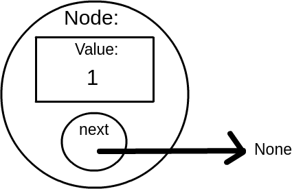
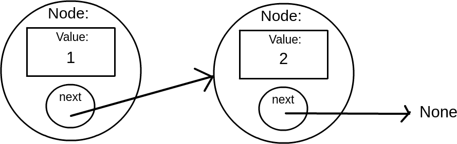
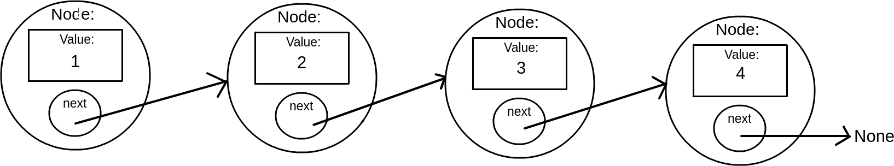
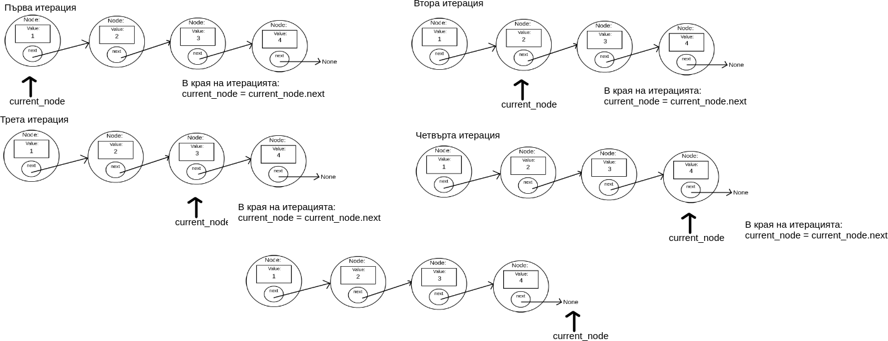

## Структури от данни
Структурите от данни са начинът, по който тези данни са организирани, така че операциите върху тези данни да са лесни, бързи и ефикасни. Досега сте запознати с поне два вида структури от данни - `list` и `dictionary`. В `list` данните са подредени последователно и се достъпват чрез съотетния индекс. В `dictionary` данните се достъпват чрез ключ. Всеки запис може да си го представите като Key-Value двойка. Достъпвате определена стойност чрез нейния ключ. 

Тук ще се разгледа и имплементира друг вид стуктура от данни - свързан списък.

## Свързан списък (Linked list)
Преди да ви въведа в свързания списък ще направя бързо припомняне за обикновения `list` в Python. 
```python
l = [1, 2, 3, 4]
print(l[0])
print(l[1])
print(l[3])
```
```
Output: 
1
2
4
```
Нищо сложно не се случва тук. Това е пример как сме запазили последователно 4 цифри и как ги достъпваме.

### Свързан списък (this time for real)
В един свързан списък данните се съхраняват във т. нар. възли (nodes). Всеки възел държи стойност и обект към възела, който е след него.



Тази готина картинка изобразява един възел. Вътре в себе си държи стойност (в случая тя е 1 - първата стойност от list-а по-горе) и следващия обект в списъка. В момента нямаме втори възел, затова `next` сочи към `None`.

Да добавим още една цифра.



Първият елемент е със стойност `1`. След като вече имаме и втори елемент, `next` на първия обектът сочи към втория `Node` със стойност `2`. Трети елемент нямаме, затова на втория възел `next` сочи към `None`. Мисля че схващате идеята. Познайте как ще изглежда картинката, ако добавим трети и четвърти възел.



### Имплементация
Как ще имплементираме това нещо в Python? Всеки възел може да бъде описан с клас. Всеки клас ще държи два обекта - стойност и `next`. 
```python
class Node:
	  def __init__(self, value):
		self.value = value
		self.next = None
```
Всеки път, когато трябва да създадем възел, ще създаваме обект от клас Node. Всеки нов възел първоначално няма следващ такъв, но трябва все пак да има в себе си обект `next`. Затова създаваме и инициализираме `self.next = None`. 

Да създадем списъка на картинката:
```python
class Node:
	  def __init__(self, value):
		self.value = value
		self.next = None

n1 = Node(1)
n2 = Node(2)
n3 = Node(3)
n4 = Node(4)
```

В момента има създадени възли, но все още нямат връзка помежду си. Правим и нея.

```python
n1.next = n2
n2.next = n3
n3.next = n4
```

Готово. Да го пробваме! Дефинираме функция, която ще приема първия възел от един свързан списък. Имайки него, тя трябва да изкара на екрана всички стойности от списъка.

```python
def print_list(first_node):
	current_node = first_node
	while current_node != None:
		print(current_node.value)
		current_node = current_node.next
```

Какво прави функцията?
1. `current_node = first_node` - Минаваме през всеки един възел от списъка. Всеки един възел достъпваме, чрез името `current_node`. Започваме от първия възел, затова казваме, че `current_node` ще сочи към същия обект, към който сочи и `first_node`. 
1. `current_node = current_node.next` - След като сме приключили със сегашния възел, преминаваме на следващия. Всеки възел държи връзка към следващия. Съответно казваме, че `current_node` ще сочи към `current_node.next`. Така с `current_node` вече достъпваме следващия елемент.
1. `while current_node != None:` - Последният възел няма следващ, затова неговият `next` сочи към None. След като на всяка итерация `current_node` сочи към следващия възел, той в един момент ще стигне последния. Когато приключи и с последния, `current_node = current_node.next` ще се изпълни, където `current_node.next` сочи към None, следователно `current_node` ще сочи към None и цикълът ще приключи.



___
При имплементация на свързан списък пазим само първия възел. Конвенцията е да го достъпваме, чрез име `head`. Да дефинираме функция, която добавя нов възел в края на списъка. Нека функцията приема `head` и само стойността, която ще се държи, а самия `Node` да го създава тя.

```python
def add(head, value):
	new_node = Node(value)
	current_node = head
	
	while current_node.next != None:
		current_node = current_node.next
	
	current_node.next = new_node
```

Какво прави функцията?
1. `def add(head, value)` - Приема само първия възел от списъка и стойността, която ще се държи във възел, който ще закачим накрая.
1. `new_node = Node(value)` - След като функцията приема стойността на новия възел, а не самия възел, тогава създаваме новия възел ние. По-късно ще разберете, защо го правим по този начин.
1. `current_node = head` - Трябва да минем през всички възли в списъка (както направихме във функцията `print_list`). Разбира се ще започнем от първия.
1. Цикъла
	```python
	while current_node.next != None:
			current_node = current_node.next
	```
	За разлика от функцията `print_list`, тук не итерираме докато `current_node` не сочи към `None`, а докато `current_node.next` не сочи към `None`. Схващате ли разликата? Искаме да стигнем до последния възел, а не до един след него. Последният възел е този, чийто `next` сочи към `None` (вижте картинките). В момента, в който `current_node.next` сочи към `None`, значи `current_node` е последния възел.
1. `current_node.next = new_node` - След като цикълът приключи, `current_node` ще сочи към текущия последен възел. Към него закачаме новия възел.

Да пробваме как работи.
```python
class Node:
	def __init__(self, value):
		self.value = value
		self.next = None

def print_list(head):
	current_node = head
	while current_node != None:
		print(current_node.value)
		current_node = current_node.next

def add(head, value):
	new_node = Node(value)
	current_node = head
	
	while current_node.next != None:
		current_node = current_node.next
	
	current_node.next = new_node

head = Node(1)

add(head, 5)
add(head, 'Multicet')

print_list(head)
```
```
Output:
1
5
Multicet
```

## Клас LinkedList
С цел удобство, четимост на кода, модуларност, капсулиране и тн., ще създадем клас `LinkedList`. Операциите ще се извършват вътре в класа. Класът ще се грижи за тях. Освен това този клас ще може да държи информация за самия списък. Примерно неговия размер. Така всеки път като създаваме списък, ще имаме дължината на всеки списък поотделно.

```python
class LinkedList:

	def __init__(self):
		self.head = None
		self.size = 0

	class Node:
		def __init__(self, value):
			self.value = value
			self.next = None

	def add(self, value):
		new_node = LinkedList.Node(value)
		current_node = self.head
	
		while current_node.next != None:
			current_node = current_node.next
	
		current_node.next = new_node
		self.size += 1

ll = LinkedList()

ll.add(1)
```

Държим `head` локално за обектите `LinkedList`, следователно го достъпваме посредством `self`. Казахме, че ще пазим размера на всеки свързан списък. За целта при инициализиране на нов обект `LinkedList`, създаваме променлива `size` и я инициализираме с 0 (първоначално списъкът е празен) - `self.size = 0`. Увеличаваме тази променлива накрая на метода `add`, т.е. всеки път като добавим нов елемент. 

Какво е първото нещо, което забелязваме щом изпълним този код? Че той не работи.

```
Output:
Traceback (most recent call last):
  File "list_ex.py", line 24, in <module>
    ll.add(1)
  File "list_ex.py", line 16, in add
    while current_node.next != None:
AttributeError: 'NoneType' object has no attribute 'next'
```

Има един съществен проблем. Кога е празен списъкът? Когато `self.head = None`.

Какво се случва? В `add` използваме `self.head`. `self.head`, обаче, е `None` в началото (още не сме добавили нищо). `current_node` сочи там, където и `self.head`, т.е. също към `None`. В цикъла се опитваме на `current_node`, който сочи към `None`, да достъпим атрибут с име `next`. Това е все едно да напишем <br>`None.next != None`. Не работи.

Просто решение - преди цикъла във функцията `add`, ще проверим дали списъкът не е празен. Ако е празен, казваме на `self.head` да сочи към новия елемент и приключваме. В случай, че ще ни трябва и в бъдеще, ще дефинираме функция, която казва дали списъкът е празен и ли не. Тя ще изглежда така:

```python
	def is_empty(self):
		return self.head == None
```

Промяната на `add` е следната:
```python
	def add(self, value):
		new_node = LinkedList.Node(value)
		current_node = self.head

		if self.is_empty(): # Notice the difference
			self.head = new_node
		else:
			while current_node.next != None:
				current_node = current_node.next

			current_node.next = new_node
			
		self.size += 1
```

Целия клас досега:
```python
class LinkedList:

	def __init__(self):
		self.head = None
		self.size = 0

	class Node:
		def __init__(self, value):
			self.value = value
			self.next = None

	def add(self, value):
		new_node = LinkedList.Node(value)
		current_node = self.head

		if self.is_empty():
			self.head = new_node
		else:
			while current_node.next != None:
				current_node = current_node.next

			current_node.next = new_node
			
		self.size += 1

	def is_empty(self):
		return self.head == None
```
```python
ll = LinkedList()

ll.add(1)
```
Не гърми.<br>
Липсва една функция, която написахме по-рано. Функцията за изкарване на списъка на екрана. Тя какво трябва да прави? Да итерира по целия списък и да изкара стойността на всеки възел. Итериране. И..террр...атор.

### Итератор
В случай, че сте забравили, може да погледнете [урока за итератори](https://github.com/bkolarov/elsys_python_course_9a_2016/blob/master/term2/iterators_generators/iterators_generators.md).
За да можем да итерираме по списъка, трябва класът `LinkedList` да спазва итератор протокола. Какъв беше той? - Да имплементира функцията `__iter__`, която да връща обект, чийто клас има функцията `__next__`. 

Ще дефинираме вътрешен за `LinkedList` клас на име `Iterator`. Негова инстанция ще се връща от метода `__iter__`. Този клас ще иска да има `head`-а на списъка. Все пак трябва да започне от първия елемент. При всяко извикване на `__next__`, този метод ще връща стойността от следващия във списъка възел.

### LinkedList.Iterator
```python
class Iterator:
		def __init__(self, head):
			self.current_node = head

		def __next__(self):
			if self.current_node == None:
				raise StopIteration
				
			current_value = self.current_node.value
			self.current_node = self.current_node.next
			
			return current_value
```

1. Итераторът трябва да започва от първия възел - `head`. 
	```python
			def __init__(self, head):
				self.current_node = head
	```
1. Списъкът е празен, ако `head` сочи към `None`. Тогава и `current_node` ще е `None`. Отделно ще сме минали всички възли от списъка, когато `current_node` стане `None` (вижте картинките по-горе). И в двата случая `self.current_node` ще е `None`, затпва трябва да кажем, че приключваме с итерирането.
	```python
			def __next__(self):
				if self.current_node == None:
					raise StopIteration
				...
	```
1. Преди да преместим `current_node` да сочи към следващия възел, трябва да запазим стойността на сегашния възел, за да може `__next__` да я върне - `current_value = self.current_node.value`
1. Преместваме `current_node` към следващия възел и връщаме запазената стойност:
	```python
	...
	self.current_node = self.current_node.next
	
	return current_value
	```
	
Целият клас `LinkedList` към момента:
```python
class LinkedList:

	def __init__(self):
		self.head = None
		self.size = 0

	class Node:
		def __init__(self, value):
			self.value = value
			self.next = None

	def add(self, value):
		new_node = LinkedList.Node(value)
		current_node = self.head

		if self.is_empty():
			self.head = new_node
		else:
			while current_node.next != None:
				current_node = current_node.next
	
			current_node.next = new_node
			
		self.size += 1

	def __iter__(self):
		return LinkedList.Iterator(self.head)

	class Iterator:
		def __init__(self, head):
			self.current_node = head

		def __next__(self):
			if self.current_node == None:
				raise StopIteration
				
			current_value = self.current_node.value
			self.current_node = self.current_node.next
			
			return current_value

	def is_empty(self):
		return self.head == None
```

Сега можем да си дефинираме отново функцията `print_list`, която този път ще приема обект `LinkedList` и ще й е много по-лесно да премине и да изкара стойностите от списъка на екрана.
```python
def print_list(linked_list):
	for value in linked_list:
		print(value)
```

```python
cars = LinkedList()
names = LinkedList()

cars.add('BMW')
cars.add('VW')
cars.add('Mazda')
cars.add('Ford')

names.add('Stamat')
names.add('Multicet')
names.add('Spas')
names.add('Mariika')
names.add('Scott Pilgrim')

print_list(cars)
print()
print_list(names)
```
```
Output:
BMW
VW
Mazda
Ford

Stamat
Multicet
Spas
Mariika
Scott Pilgrim
```
