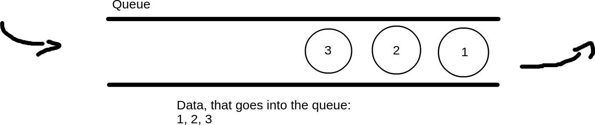
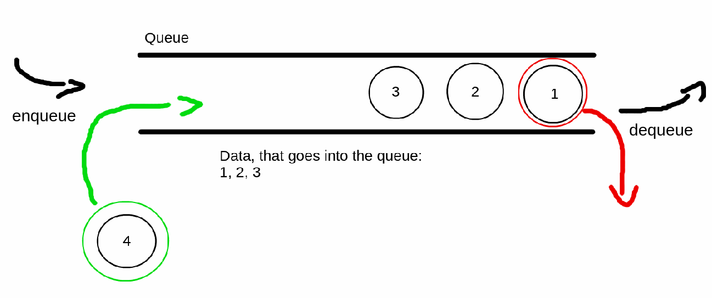
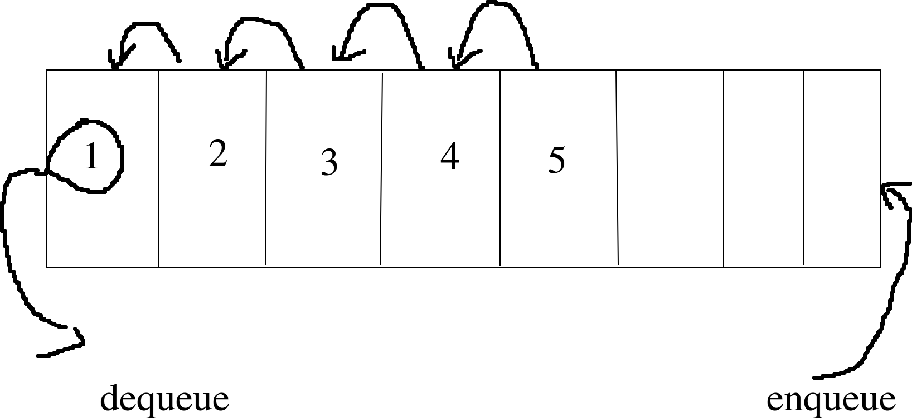
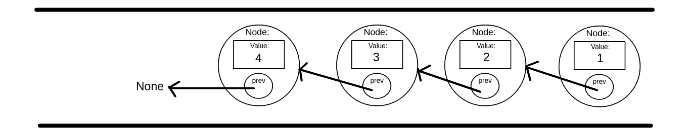
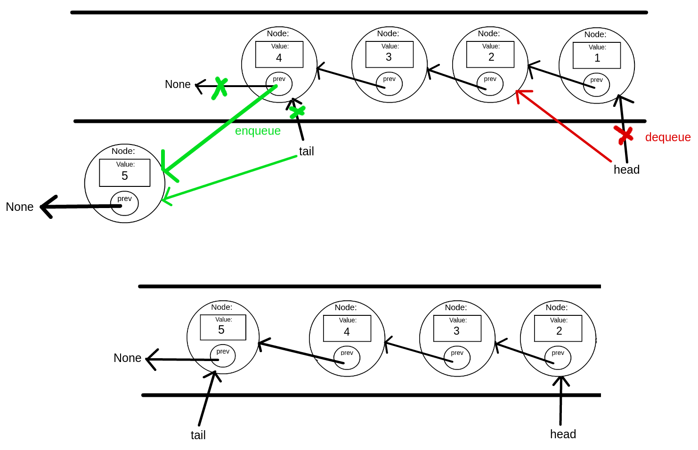
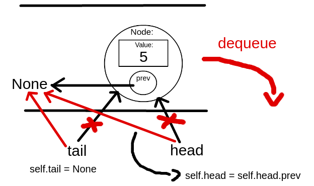

# Опашка (Queue)
Преди да сте чели този урок е добре да сте минали този за [свързани списъци](https://github.com/bkolarov/elsys_python_course_9a_2016/blob/master/term2/linked_list/linked_list.md).

Опашката е вид структура от данни. Заедно с опашка, трябва да запомните думата FIFO - First In First Out. Това е принципът, по който данните се вкарват в структурата и се изкарват от нея. 

Представете си опашка на каса. Който първи стигне, той първи ще свърши работа и ще си тръгне. Всеки нов клиент се нарежда най-отзад на опашката. По същия начин се записват и изкарват данните от една такава структура от данни. 



Операциите по тази структура са:
* enqueue - добавяме нов запис най-отзад в опашката
* dequeue - изкарваме записа, кой се намира най-отпред в опашката



Триене посредата на опашката нямаме. Приемаме, че трябва да минем през цялата информация, която е записана в структурата. Ако някой е решил да се реди за безплатни кебабчета, няма да си тръгне, пък каквото ще да става.

# Имплементация
Опашка може да се имплементира по повече от един начин. Може да е чрез обикновен масив, може и чрез свързан списък. 

### Чрез масив
При имплементация чрез масив държим всички елементи в един масив (очевидно) или в случая в Python ги държим в `list`. Първият, който е записан в опашката, ще е първият елемент от масива. Вторият ще е втория елемент и тн. Проблемът е, когато вадим от опашката. Винаги вадим първия (този най-отпред). Това значи, че след като извадим най-първия елемент, трябва да преместим всички останали с едно, така че вторият да стане първи, третият да стане втори и тн.



Това ще се случва всеки път при вадене от опашката.

### Чрез свързан списък
Това е начинът, който ние ще имплементираме. При този подход записите, също като в свързания списък, ще се държат във визли (nodes). Всеки възел ще държи съответната стойност. Разликата идва там, че при свързания списък всеки възел държи връзка към следващия. Тук всеки възел държи връзка към предишния. Ценко е първи на опашката. Зад него идва Марто. Зад Марто идва Никола. Ценко знае, че Марто е зад него, а Марто знае, че Никола е зад него. Никола пък знае, че няма никого зад него (None).



При работата с тази структура ще празим две връзки. Връзка към първия възел, която ще наричаме `head` и връзка към последния, която ще наричаме `tail`. Всеки път като добавяме елемент, ще го закачаме като предишен елемент на `tail`. Всеки път като вадим елемент, ще преместваме `head` да сочи към неговия предишен.

На изображението по-долу е показана една и съща опашка. В горната опашка махаме един възел и добавяме нов. Долната опашка е резултата.


# Клас Queue
Също като при свързания списък, ще имаме един клас, който ще се грижи за добавянето и махането на елементи. Ще имаме и втори вътрешен клас Node, който да представлява възела.

```python
class Queue:
	def __init__(self):
        # The queue is empty but it must have its attributes head and tail. Create them and initialize them with None.
        # Also create the size attribute and initialize it with 0 (again, the queue is empty).
		self.head = self.tail = None
        self.size = 0
		
	class Node:
		def __init__(self, value):
			self.value = value
			self.prev = None
```

## enqueue()
Функцията за добавяне ще приема стойността, която искаме да държим в опашката. Тя ще създава възела и ще го добавя като предишен на сегашния `tail`. Имаме два случая, които могат да възникнат:
- Опашката може да е празна - тогава и `head` и `tail` ще бъдат `None`. В този случай и на двата ще кажем да сочат към новия възел.
- Опашката не е празна - тогава просто добавяме новия възел като предишен на `tail`. После преместваме `tail` да сочи към новия възел, тъй като той ще е новият последен такъв. Когато се наредите на опашка в лавката, вие ставате последния чакащ.

```python
def enqueue(self, value):
		new_node = Queue.Node(value)
		
		if self.is_empty():
			self.head = self.tail = new_node
		else:
			self.tail.prev = new_node
			self.tail = new_node
			
		self.size += 1
		
	def is_empty(self):
		return self.head == None and self.tail == None
```
```
q = Queue()

q.enqueue(1)
q.enqueue(2)
q.enqueue(3)

current = q.head
while current != None:
	print(current.value)
	current = current.prev
```
```
Output:
1
2
3
```
Какво прави функцията?
- Функцията приема стойност. Създаваме възел, в който да я държим:
    ```python
    def enqueue(self, value):
		new_node = Queue.Node(value)
    ```
- Обработка на случая, ако опашката е празна:
    ```python
    if self.is_empty():
			self.head = self.tail = new_node
    ...
    ```
    Дефинирали сме си функция, която проверява дали опашката е празна и връща съответно `True` или `False`. Опашката е празна, когато и `head` и `tail` сочат към `None`. 
    В случай, че опашката е празна, когато добавим нов възел, той е и пръв и последен. Следователно и `head` и `tail` трябва да сочат към новия възел.
- Добавяне, когато в опашката има възли:
    ```python
    ...
    else:
			self.tail.prev = new_node
			self.tail = new_node
    ```
    Ако в опашката вече има възли, то `tail` сочи към текущия последен такъв. Когато добавяме нов, казваме на последния кой му е преидшен: `self.tail.prev = new_node`. След което преместваме `tail` да сочи към новия последен: `self.tail = new_node`. 
- Увеличаваме размера с единица.

## len()
Също като при свързания списък можем да имплементираме функцията `__len__` в класа `Queue`. Така можем да подадем обекта на опашката на вградената функция `len()` и да разберем какъв е нейният размер.

```python
	def __len__(self):
		return self.size
```

## dequeue()
Когато вадим възел от опашката, вадим този, който е най-отпред (този, към който сочи `head`). На опашката на касата, касиерът обслужва първият на опашката, а не последния. Иначе щеше да е странно. Припомням пак методологията FIFO - First In First Out.
Когато клиент стигне до касата, касиерът взима информация от него, а именно какво иска да плати този човек. Съответно в имплементацията на опашката правим същото. Когато изкарваме възел от нея, взимаме стойността, която е в него. Тази стойност ще бъде връщана от `dequeue()`.

```python
def dequeue(self):
		dequeued_value = None
		
		if self.is_empty():
			dequeued_value = None
		elif self.size == 1:
			dequeued_value = self.head.value
			self.head = self.head.prev
			self.tail = None
		else:
			dequeued_value = self.head.value
			self.head = self.head.prev
			
			
		self.size = (self.size - 1) if self.size > 0 else 0
		
		return dequeued_value
```
```python
def print_queue(q):
	current = q.head
	if current == None:
		return
		
	while current != None:
		print(current.value)
		current = current.prev

def print_info(msg, q):
	print(msg)
	print('queue size: {}'.format(len(q)))
	print_queue(q)
	print()

q = Queue()

q.enqueue(1)
q.enqueue(2)
q.enqueue(3)

print_info('before dequeue', q)

print('dequeued value: {}'.format(q.dequeue()))
print_info('after dequeue', q)

print('dequeued value: {}'.format(q.dequeue()))
print_info('after second dequeue', q)

print('dequeued value: {}'.format(q.dequeue()))
print_info('after third dequeue', q)

print('dequeued value: {}'.format(q.dequeue()))
print_info('after dequeue from empty queue', q)
```
```
Output:
before dequeue
queue size: 3
1
2
3

dequeued value: 1
after dequeue
queue size: 2
2
3

dequeued value: 2
after second dequeue
queue size: 1
3

dequeued value: 3
after third dequeue
queue size: 0

dequeued value: None
after dequeue from empty queue
queue size: 0

```

Какво прави функцията?
- `dequeue()` трябва да върне стойност. Има няколко случая, които трябва да съобразим при dequeue, но при всеки един ние все пак трябва да върнем нещо. Предварително си създаваме променлива за връщаната стойност и приемаме, че тя първоначално ще е `None`:
	```python
	def dequeue(self):
		dequeued_value = None
	```
- Случай, в който опашката е празна:
	```python
	if self.is_empty():
			dequeued_value = None
	...
	```
	Когато опашката е празна, няма какво да върнем, затова ще върнем `None`.
- Когато в опашката е останал само един възел и искаме да извадим и него тярбва да се замислим за едно нещо. По принцип при всяко вадене от опашката, ние преместваме `head` към предишния, на този който вадим, възел. В същото време `tail` не го пипаме. Той винаги си сочи към последния възел (този най-отзад). Когато обаче ние е останал само един възел, щом извадим и него, трябва и `head` и `tail` да сочат към `None`. Ако преместим само `head`, да сочи към предишния на този възел (възелът е последния останал, предишният му е `None`), тогава само `head` ще сочи към `None`, но `tail` ще продължи да сочи към съшия този възел. Затова в този случай, трябва да откъснем и двете връзки.
```python
...
elif self.size == 1:
	dequeued_value = self.head.value
	# This is the last node in the queue hence both head and tail should be None after dequeue.
	self.head = self.head.prev # self.head.prev is None since self.head points to the last node
	self.tail = None
...
```


Целият клас досега:
```python
class Queue:
	def __init__(self):
		self.head = self.tail = None
		self.size = 0
		
	class Node:
		def __init__(self, value):
			self.value = value
			self.prev = None
			
	def enqueue(self, value):
		new_node = Queue.Node(value)
		
		if self.is_empty():
			self.head = self.tail = new_node
		else:
			self.tail.prev = new_node
			self.tail = new_node
			
		self.size += 1
		
	def dequeue(self):
		dequeued_value = None
		
		if self.is_empty():
			dequeued_value = None
		elif self.size == 1:
			dequeued_value = self.head.value
			self.head = self.head.prev
			self.tail = None
		else:
			dequeued_value = self.head.value
			self.head = self.head.prev
			
			
		self.size = (self.size - 1) if self.size > 0 else 0
		
		return dequeued_value
		
	def __len__(self):
		return self.size
		
	def is_empty(self):
		return self.head == None and self.tail == None
```

## peek()
`peek()` е една доста проста функция. Тя връща стойността на първия възел в опашката (т.е. връща стойността на възела, към който сочи `head`), без да го вади.

```python
def peek(self):
	if self.is_empty():
		return None
	else:
		return self.head.value
```
```python
q = Queue()

q.enqueue('First')
q.enqueue('Second')
q.enqueue('Third')

print('peek: {}'.format(q.peek()))
print('dequeue: {}'.format(q.dequeue()))
print('peek: {}'.format(q.peek()))
```
```
Output:
peek: First
dequeue: First
peek: Second
```
